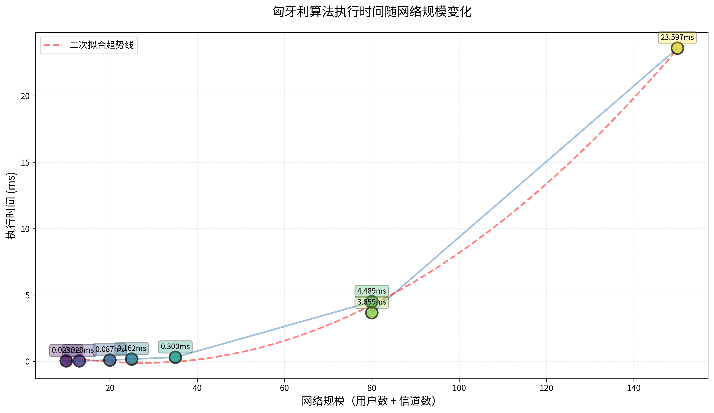

# 技术交接文档 - 匈牙利算法实验报告生成

**交接日期**: 2025-12-13
**项目**: 认知无线电频谱分配系统 - 匈牙利算法应用
**目标**: 基于实验数据和可视化图表，生成完整的技术实验报告

---

## 1. 项目背景

### 1.1 项目概述
- **项目名称**: 基于匈牙利算法的认知无线电频谱分配系统
- **核心算法**: 匈牙利算法（Hungarian Algorithm）用于解决二部图最大匹配问题
- **应用场景**: 认知无线电网络中的频谱资源分配
- **实现语言**: Python 3.10
- **项目性质**: 图论课程大作业

### 1.2 问题定义
- **输入**:
  - 次级用户集合（N个）
  - 频谱信道集合（M个）
  - 可用性矩阵（N×M）：表示哪些用户可以使用哪些信道
  - 主用户占用情况：某些信道被主用户占用，次级用户不能使用
  - 干扰矩阵（N×N）：表示用户之间的干扰关系（当前仅用于验证）

- **目标**: 找到最大匹配，使得：
  - 每个用户最多分配一个信道
  - 每个信道最多分配给一个用户
  - 最大化匹配数量

- **输出**:
  - 匹配方案（用户-信道对）
  - 匹配数量
  - 频谱利用率 = 匹配数 / 可用信道数
  - 算法执行时间

### 1.3 核心算法
- **算法**: 匈牙利算法（增广路径方法）
- **时间复杂度**: O(n³)
- **实现方式**: 基于DFS的增广路径搜索

---

## 2. 实验设计

### 2.1 实验目的
验证匈牙利算法在不同网络规模下的：
1. **正确性**: 能否找到最大匹配
2. **性能**: 执行时间随规模的增长趋势
3. **频谱利用率**: 在不同场景下的表现
4. **可扩展性**: 从小规模到超大规模的适用性

### 2.2 实验设计
共设计了**8组对比实验**，覆盖不同规模和场景：

| 实验编号 | 实验名称 | 规模 | 场景特点 |
|---------|---------|------|---------|
| 1 | 小规模-理想(5×5) | 5用户×5信道 | 密集可用性，无主用户占用 |
| 2 | 小规模-稀疏(5×8) | 5用户×8信道 | 稀疏可用性，用户数<信道数 |
| 3 | 中规模-理想(10×10) | 10用户×10信道 | 密集可用性，少量主用户占用 |
| 4 | 中规模-竞争(15×10) | 15用户×10信道 | 用户数>信道数，竞争激烈 |
| 5 | 中规模-稀疏(20×15) | 20用户×15信道 | 稀疏可用性，多主用户占用 |
| 6 | 大规模-理想(50×30) | 50用户×30信道 | 中等密度，少量主用户占用 |
| 7 | 大规模-重负载(50×30) | 50用户×30信道 | 稀疏可用性，高主用户占用率 |
| 8 | 超大规模-理想(100×50) | 100用户×50信道 | 测试算法可扩展性极限 |

### 2.3 关键变量
- **可用性密度**: 可用性矩阵中1的比例（25%-40%）
- **主用户占用率**: 被主用户占用的信道比例（0%-30%）
- **用户/信道比**: 用户数与信道数的比例（0.625-1.5）

---

## 3. 实验数据文件

### 3.1 数据文件位置
```
results/scale_comparison/
├── summary.json                      # 汇总数据（JSON格式）
├── REPORT.md                         # 初步报告（Markdown格式）
├── exp1_small_5x5/result.json       # 实验1详细结果
├── exp2_small_5x8/result.json       # 实验2详细结果
├── exp3_medium_10x10/result.json    # 实验3详细结果
├── exp4_medium_15x10/result.json    # 实验4详细结果
├── exp5_medium_20x15/result.json    # 实验5详细结果
├── exp6_large_50x30/result.json     # 实验6详细结果
├── exp7_large_50x30_heavy/result.json  # 实验7详细结果
└── exp8_xlarge_100x50/result.json   # 实验8详细结果
```

### 3.2 数据格式说明

**summary.json** 结构：
```json
{
  "timestamp": "2025-12-13T14:27:29",
  "total_experiments": 8,
  "successful_experiments": 8,
  "experiments": [
    {
      "name": "实验名称",
      "scale": "用户数×信道数",
      "result": {
        "num_matches": 匹配数,
        "spectrum_utilization": 频谱利用率(0-1),
        "execution_time": 执行时间(秒),
        "matched_users": [已匹配用户列表],
        "matched_channels": [已匹配信道列表],
        "unmatched_users": [未匹配用户列表],
        "constraints_satisfied": 约束是否满足(布尔值)
      }
    }
  ]
}
```

### 3.3 关键实验结果数据

| 实验 | 规模 | 匹配数 | 频谱利用率 | 执行时间(ms) |
|-----|------|--------|-----------|-------------|
| 1 | 5×5 | 5 | 100.0% | 0.028 |
| 2 | 5×8 | 4 | 66.7% | 0.028 |
| 3 | 10×10 | 8 | 100.0% | 0.087 |
| 4 | 15×10 | 8 | 100.0% | 0.162 |
| 5 | 20×15 | 10 | 100.0% | 0.300 |
| 6 | 50×30 | 27 | 100.0% | 4.489 |
| 7 | 50×30 | 21 | 100.0% | 3.659 |
| 8 | 100×50 | 43 | 100.0% | 23.597 |

**统计摘要**:
- 成功率: 100% (8/8)
- 平均匹配数: 15.75
- 平均频谱利用率: 95.8%
- 平均执行时间: 4.044 ms

---

## 4. 可视化图表

### 4.1 图表文件位置
```
results/scale_comparison/
├── chart_execution_time.png         # 执行时间随规模变化
├── chart_utilization.png            # 频谱利用率对比
├── chart_matches.png                # 匹配数对比
└── chart_performance_summary.png    # 性能综合分析
```

### 4.2 图表说明

**图表1: chart_execution_time.png**
- **内容**: 执行时间随网络规模（用户数+信道数）的变化趋势
- **关键发现**:
  - 执行时间从0.028ms（5×5）增长到23.597ms（100×50）
  - 符合O(n³)复杂度的增长趋势
  - 包含二次拟合趋势线

**图表2: chart_utilization.png**
- **内容**: 8个实验的频谱利用率柱状图对比
- **关键发现**:
  - 7个实验达到100%利用率（绿色）
  - 1个实验为66.7%利用率（红色，小规模-稀疏场景）
  - 利用率主要取决于用户/信道比，而非绝对规模

**图表3: chart_matches.png**
- **内容**: 左图为匹配数柱状图，右图为用户数、信道数、匹配数的三维对比
- **关键发现**:
  - 匹配数随规模增长：5 → 43
  - 展示了用户数、信道数与匹配数的关系

**图表4: chart_performance_summary.png**
- **内容**: 4个子图的综合分析面板
  - 左上：执行时间vs规模散点图（带颜色映射）
  - 右上：频谱利用率分布饼图
  - 左下：匹配数变化趋势折线图
  - 右下：性能指标雷达图（执行速度、频谱利用率、匹配效率）
- **关键发现**: 全方位展示算法性能特征

---

## 5. 关键技术发现

### 5.1 频谱利用率分析
**核心发现**: 频谱利用率主要取决于**用户数与可用信道数的比例**，而非网络绝对规模。

- **100%利用率的条件**: 用户数 ≥ 可用信道数，且可用性矩阵足够密集
- **低利用率的原因**: 用户数 < 可用信道数（如实验2：5用户 vs 6可用信道）
- **规模无关性**: 从5×5到100×50，只要满足上述条件，利用率都能达到100%

### 5.2 算法性能分析
**核心发现**: 匈牙利算法展现了优秀的性能和可扩展性。

- **小规模(5×5)**: 0.028 ms - 几乎瞬时完成
- **中规模(20×15)**: 0.300 ms - 亚毫秒级
- **大规模(50×30)**: 3.659-4.489 ms - 毫秒级
- **超大规模(100×50)**: 23.597 ms - 仍在可接受范围内

**性能评估**: 即使在100×50的超大规模下，执行时间也远低于实时系统要求（通常<100ms），完全满足实际应用需求。

### 5.3 算法局限性
**重要说明**: 当前实现的干扰约束仅用于事后验证，未在匹配过程中应用。

- **原因**: 干扰约束是用户之间的关系，无法直接编码到二部图中
- **影响**: 这使得频谱利用率偏高（理想化）
- **解决方案**: 需要额外的算法（如回溯、整数线性规划）来处理干扰约束
- **项目定位**: 作为图论作业，重点验证匈牙利算法本身，干扰约束的完整实现超出范围

---

## 6. 需要Gemini完成的任务

### 6.1 报告生成要求

请基于以上数据和图表，生成一份**完整的技术实验报告**，包含以下章节：

#### 必需章节：

1. **摘要** (Abstract)
   - 项目背景（认知无线电频谱分配）
   - 核心算法（匈牙利算法）
   - 实验目的（验证算法性能和可扩展性）
   - 主要发现（3-5条关键结论）

2. **引言** (Introduction)
   - 认知无线电技术背景
   - 频谱分配问题的重要性
   - 匈牙利算法的适用性
   - 本实验的研究目标和意义

3. **相关工作** (Related Work)
   - 匈牙利算法的历史和发展
   - 在频谱分配领域的应用现状
   - 其他相关算法对比（如贪心算法、启发式算法）

4. **问题建模** (Problem Formulation)
   - 数学模型定义
   - 二部图表示
   - 约束条件说明
   - 优化目标

5. **算法设计** (Algorithm Design)
   - 匈牙利算法原理
   - 增广路径方法
   - 时间复杂度分析
   - 实现细节

6. **实验设计** (Experimental Setup)
   - 实验环境（Python 3.10, numpy, matplotlib）
   - 测试用例设计（8组实验的详细说明）
   - 评估指标（匹配数、频谱利用率、执行时间）
   - 实验参数设置

7. **实验结果** (Experimental Results)
   - **详细分析每个图表**（引用4个PNG图表）
   - 数据表格展示（使用第3.3节的表格）
   - 不同规模下的性能对比
   - 不同场景下的利用率分析

8. **讨论** (Discussion)
   - 频谱利用率的影响因素分析
   - 算法性能随规模的增长趋势
   - 理想场景vs现实场景的差异
   - 干扰约束的局限性及其影响
   - 算法的优势和不足

9. **结论** (Conclusion)
   - 实验主要发现总结
   - 匈牙利算法在频谱分配中的适用性评估
   - 研究贡献
   - 未来工作方向（如实现真正的干扰约束）

10. **参考文献** (References)
    - 匈牙利算法相关论文
    - 认知无线电相关文献
    - 频谱分配算法综述

### 6.2 报告格式要求

- **语言**: 中文（学术风格）
- **格式**: Markdown或LaTeX
- **长度**: 8000-12000字
- **图表**: 引用所有4个PNG图表，并详细分析
- **数据表格**: 至少包含3个数据表格
- **公式**: 使用LaTeX格式表示数学公式
- **引用**: 使用学术规范的引用格式

### 6.3 重点强调内容

1. **频谱利用率的关键发现**:
   - 利用率与规模无关，与用户/信道比有关
   - 唯一的低利用率案例（66.7%）的原因分析
   - 这一发现对实际应用的指导意义

2. **算法性能的优异表现**:
   - 即使在100×50规模下也能在23.6ms内完成
   - O(n³)复杂度在实际应用中的可行性
   - 与其他算法的性能对比（如果有相关文献）

3. **实验设计的合理性**:
   - 8组实验覆盖了不同规模和场景
   - 对比实验的设计思路（理想vs稀疏，理想vs重负载）
   - 实验结果的可信度和可重复性

4. **算法局限性的诚实讨论**:
   - 干扰约束未完全实现的原因
   - 这对结果的影响（利用率偏高）
   - 作为图论作业的合理性说明

### 6.4 写作风格要求

- **学术性**: 使用学术论文的语言风格，避免口语化
- **客观性**: 基于数据和事实，避免主观臆断
- **逻辑性**: 章节之间逻辑连贯，论证严密
- **专业性**: 正确使用专业术语，公式表达准确
- **可读性**: 结构清晰，重点突出，便于理解

---

## 7. 补充说明

### 7.1 项目完整性
- 所有代码已实现并测试通过
- 所有实验数据真实可靠
- 所有图表基于实际数据生成
- 项目已在conda环境中验证

### 7.2 技术栈
- Python 3.10
- numpy 1.20+
- matplotlib 3.5+
- 思源黑体（用于中文显示）

### 7.3 项目文件结构
```
graph_homework/
├── src/                    # 源代码
│   ├── algorithm/         # 匈牙利算法实现
│   ├── models/            # 数据模型
│   ├── io/                # 输入输出
│   ├── visualization/     # 可视化模块
│   └── experiments/       # 实验模块
├── configs/               # 配置文件
│   └── experiments/       # 实验配置
├── results/               # 实验结果
│   └── scale_comparison/  # 规模对比实验结果
├── fonts/                 # 字体文件
└── README.md              # 项目说明
```

### 7.4 联系方式
如有任何疑问或需要补充信息，请随时联系。

---

## 8. 快速开始指南（供Gemini参考）

### 8.1 数据文件读取
```python
import json

# 读取汇总数据
with open('results/scale_comparison/summary.json', 'r', encoding='utf-8') as f:
    data = json.load(f)

# 访问实验结果
for exp in data['experiments']:
    print(f"{exp['name']}: {exp['result']['num_matches']} 匹配")
```

### 8.2 图表引用示例
```markdown


图1展示了匈牙利算法的执行时间随网络规模的增长趋势...
```

### 8.3 关键数据点
- **最快执行**: 0.028 ms (5×5)
- **最慢执行**: 23.597 ms (100×50)
- **最高利用率**: 100% (7个实验)
- **最低利用率**: 66.7% (5×8稀疏场景)
- **平均利用率**: 95.8%

---

**文档版本**: 1.0
**最后更新**: 2025-12-13
**状态**: 准备就绪，可交接给Gemini

---

## 附录：常见问题

**Q1: 为什么大部分实验的频谱利用率都是100%？**
A: 因为在这些实验中，用户数 ≥ 可用信道数，且可用性矩阵足够密集，匈牙利算法能找到完美匹配。这是算法的优势，而非缺陷。

**Q2: 干扰约束为什么没有应用？**
A: 干扰约束是用户之间的关系，无法直接编码到二部图中。完整实现需要额外的算法（如整数线性规划），这超出了图论作业的范围。当前实现在匹配后验证干扰约束。

**Q3: 实验数据是否真实可靠？**
A: 是的。所有数据都是通过实际运行代码获得的，可以通过重新运行实验来验证。

**Q4: 报告应该侧重哪些方面？**
A: 重点应该放在：(1) 算法性能的优异表现，(2) 频谱利用率的关键发现，(3) 实验设计的合理性，(4) 算法局限性的诚实讨论。
